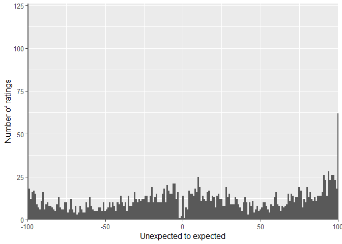
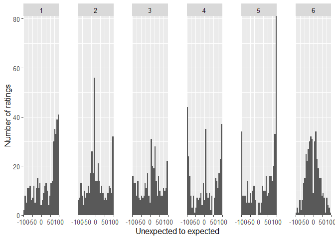
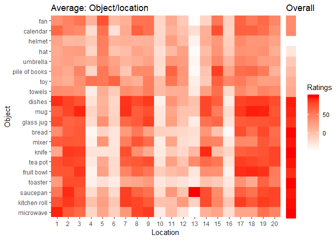
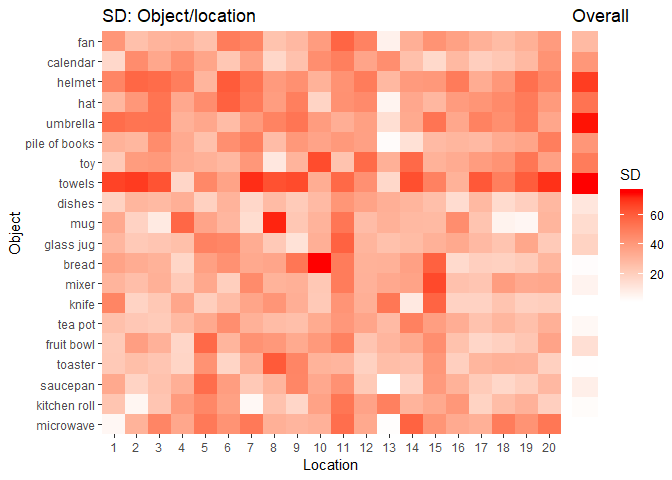
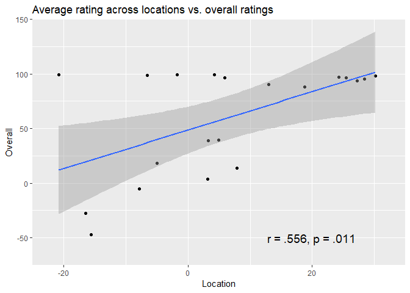

Untitled
================

Introduction
============

The aim of the experiment of which I present some the results here was to get expectancy values for specific objects at specific location in a virtual kitchen. There were twenty possible objects and locations. After the completing these ratings, the participants were asked to rate the overall expectancy of those objects for a kitchen. The scale ranged from -100 (unexpected) to 100 (expected) and was continuous. Here I will visualise and interpret the results. Participants were helpful member of the research group. The code for the task can be found <https://github.com/JAQuent/ratingStudy>.

Used libraries and functions
----------------------------

``` r
library(ggplot2)
library(gridExtra)

pValue <-function(x, sign = '='){
  if (inherits(x, "lm")){
    s <- summary.lm(x)
    x <- pf(s$fstatistic[1L], s$fstatistic[2L], s$fstatistic[3L], lower.tail = FALSE)
    if(x > 1){
      stop("There is no p-value greater than 1")
    } else if(x < 0.001){
      x.converted <- '< .001'
    } else{
      x.converted <- paste(sign,substr(as.character(round(x, 3)), 2,5))
    } 
  } else {
    if(x > 1){
      stop("There is no p-value greater than 1")
    } else if(x < 0.001){
      x.converted <- '< .001'
    } else{
      x.converted <- paste(sign,substr(as.character(round(x, 3)), 2,5))
    } 
  }
  return(x.converted)
}

rValue <-function(x){
  if (inherits(x, "lm")){
    r.squared <- summary(x)$r.squared
    x.converted <- paste('=',substr(as.character(round(r.squared, 3)), 2,5)) 
  } else {
    if (x < 0){
      x.converted <- paste('= -',substr(as.character(abs(round(x, 3))), 2,5), sep = '') 
    } else {
      x.converted <- paste('=',substr(as.character(abs(round(x, 3))), 2,5)) 
    }
  }
  return(x.converted) 
}
```

Loading the rating data
-----------------------

I start with loading the data and creating a 20 x 20 x N matrix holding all 400 location ratings for all participants. Similarly, I create a 20 x N matrix to hold the 20 objects ratings. After that, I shuffle the data because people in the group could otherwise infer the identity of the other participants.

``` r
# Prepare
subNo           <- 1:6
N               <- length(subNo)
locationRatings <- array(data = NA, dim = c(20, 20, N))
objectRatings   <- matrix(NA, 20, N)

# Sequently loading data
for(i in 1:N){
  locationRatings[,,i] <- matrix(scan(paste('U:/Projects/schemaVR/normativeStudy/normativeData/locationRatings_', as.character(subNo[i]) ,'.dat', sep = '')), byrow = TRUE, ncol = 20)
  objectRatings[,i]    <- scan(paste('U:/Projects/schemaVR/normativeStudy/normativeData/objectRatings_', as.character(subNo[i]) ,'.dat', sep = ''))
}

# Shuffle to anonymise the data
shuffle         <- sample(1:N)
locationRatings <- locationRatings[,,shuffle]
objectRatings   <- objectRatings[,shuffle]
```

After successfully loading the data and saving it in the matrices, I want to look at distribution of the location ratings. I collapse the data across all 6 participants and create a histogram:

``` r
# Create a data frame and split by participant
locationRatingsDF <- data.frame(ID = as.factor(rep(1:N, each = 400)), ratings = c(locationRatings))

# Create plot
ggplot(locationRatingsDF, aes(ratings)) + geom_histogram(binwidth = 1) + theme(panel.margin = unit(1, "cm"), text = element_text(size = 12)) + 
        labs(y = 'Number of ratings', x = 'Unexpected to expected') + 
        coord_cartesian(xlim = c(-100, 100), expand = FALSE)
```



The ratings are spread across the scale. However it is also interesting to look at the individual distributions. There were I plot one histograms for each participant.

``` r
ggplot(locationRatingsDF, aes(ratings)) + facet_grid(. ~ ID) + geom_histogram() + theme(panel.margin = unit(1, "cm"), text = element_text(size = 12)) + 
        labs(y = 'Number of ratings', x = 'Unexpected to expected') + 
        coord_cartesian(xlim = c(-100, 100), expand = FALSE)
```



Looking at the individual data, it is quite apparent that the distributions differ quite profoundly in terms how their responses are spread. On looks a bit Gaussian with a small dip around zero, while other distributions tended to include many extreme responses.

As I want to use this data to create a distribution to draw a combination of objects and locations from, I average the matrices and calculate the standard deviations to have an idea how the raters differed from each other. Therefore, I create heatmaps to visualise the results.

``` r
objectNames <- c('microwave','kitchen roll','saucepan', 'toaster','fruit bowl','tea pot','knife','mixer','bread','glass jug','mug','dishes','towels','toy','pile of books','umbrella','hat','helmet','calendar','fan')

# Calculate metrics
averageLocationRatings <- apply(locationRatings, 1:2, mean)
sdLocationRatings      <- apply(locationRatings, 1:2, sd)
averageObjectRatings   <- apply(objectRatings, 1, mean)
sdObjectRatings        <- apply(objectRatings, 1, sd)

# Create dataframes to plot
averageLocationRatingsDF <- data.frame(Object = rep(factor(1:20, labels = objectNames), 20), Location = as.factor(rep(1:20, each = 20)), Ratings = c(averageLocationRatings))
sdLocationRatingsDF      <- data.frame(Object = rep(factor(1:20, labels = objectNames), 20), Location = as.factor(rep(1:20, each = 20)), SD = c(sdLocationRatings))

averageObjectRatingsDF  <- data.frame(Object = factor(1:20, labels = objectNames), Ratings = c(averageObjectRatings))
sdObjectRatingsDF       <- data.frame(Object = factor(1:20, labels = objectNames), SD = c(sdObjectRatings))

# Create average heatmaps
plot1 <- ggplot(averageLocationRatingsDF, aes(Location, Object)) + geom_tile(aes(fill = Ratings)) + scale_fill_gradient(low = "white", high = "red") + scale_x_discrete(expand = c(0, 0)) +  scale_y_discrete(expand = c(0, 0)) + labs(title = 'Average: Object/location') + theme(legend.position = 'none')

plot2 <- ggplot(averageObjectRatingsDF, aes(x = 1, y = Object)) + geom_tile(aes(fill = Ratings)) + scale_fill_gradient(low = "white", high = "red") + scale_x_discrete(expand = c(0, 0)) +  scale_y_discrete(expand = c(0, 0)) + labs(x = '', title = 'Overall') + theme(axis.title.y = element_blank(), axis.text.y = element_blank(), axis.ticks.y = element_blank(), plot.margin=unit(c(0.2, 0, 0.62, 0),"cm"))
grid.arrange(plot1, plot2, ncol = 2, widths = c(5.5, 1))
```



The first twelve objects (from microwave to dishes) are supposed to be expected in a kitchen. This is also visible in the heatmaps both in the heatmap showing the average ratings for every object/location combination and in the overall heatmap showing the average ratings for the overall expectancy of a particular object in kitchen. From the white vertical stripes, it is also apparent that no object is really expected for some locations. One of those location for instance is on the floor in a corner of the room.

``` r
# Create Sd heatmap
plot3 <- ggplot(sdLocationRatingsDF, aes(Location, Object)) + geom_tile(aes(fill = SD)) + scale_fill_gradient(low = "white", high = "red") + scale_x_discrete(expand = c(0, 0)) +  scale_y_discrete(expand = c(0, 0)) + labs(title = 'SD: Object/location') + theme(legend.position = 'none')

plot4 <- ggplot(sdObjectRatingsDF, aes(x = 1, y = Object)) + geom_tile(aes(fill = SD)) + scale_fill_gradient(low = "white", high = "red") + scale_x_discrete(expand = c(0, 0)) +  scale_y_discrete(expand = c(0, 0)) + labs(x = '', title = 'Overall') + theme(axis.title.y = element_blank(), axis.text.y = element_blank(), axis.ticks.y = element_blank(), plot.margin=unit(c(0.2, 0, 0.62, 0),"cm"))

grid.arrange(plot3, plot4, ncol = 2, widths = c(5.5, 1))
```



The SD are quite high in general. This stems from the fact that participants seem to have used difference response criterions. It is notable there is a lot of disagreement among the participant with regard to expectancy of the towel. This definitely needs more attention and I am considering not to use the towels.

Finally, I am also interest to see whether there is a relationship between the average expectancy across all locations and the overall expectancy rated at the end of the experiment.

``` r
objectAverageLocation <- rowMeans(averageLocationRatings)
correlationDF         <- data.frame(Object = factor(1:20, labels = objectNames), Location = objectAverageLocation, Overall = averageObjectRatings)

correlation <- cor.test(~ Overall + Location, data = correlationDF)

ggplot(correlationDF, aes(x = Location, y = Overall)) + geom_point() + geom_smooth(method = 'lm') + coord_cartesian(xlim = c(-25, 35), ylim = c(-75, 150), expand = FALSE) + labs(title = 'Average rating across locations vs. overall ratings') + annotate("text", x = 20, y = -50, label = paste('r ', rValue(correlation$estimate), ', p ' , pValue(correlation$p.value), sep = '') , size = 5)
```



As it turns out, there is a significant positive correlation between the average ratings across locations and the overall ratingsr, *r* = .556, *p* = .011.
